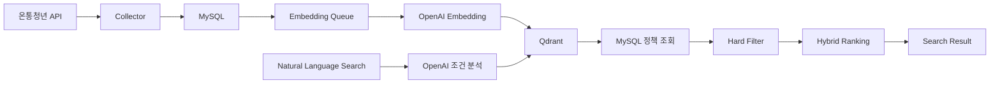

# Youthcenter Search

온통청년 정책을 수집하고 MySQL과 Qdrant에 저장하여 자연어 기반으로 검색하는 청년정책 RAG 서비스입니다.

## 기술 스택

- Java 17, Spring Boot 3.5.16, Gradle Groovy DSL
- Spring MVC, Spring Data JPA, Flyway, MySQL 8.4.3
- Spring AI 1.1.8, OpenAI Chat/Embedding, Qdrant
- Thymeleaf, Vanilla JavaScript, CSS
- JUnit 5, MockWebServer, Testcontainers

## 아키텍처



사용자 검색 시 온통청년 API를 실시간 호출하지 않습니다. 정책 수집과 임베딩은 관리자 화면에서 사전에 실행하고, 검색은 MySQL과 Qdrant에 저장된 온통청년 정책만 사용합니다.

## 온통청년 API

현재 API만 사용합니다.

```text
GET https://www.youthcenter.go.kr/go/ythip/getPlcy
```

요청 파라미터:

- `apiKeyNm`: 서버 설정에서만 사용하며 화면과 로그에는 마스킹합니다.
- `pageType=1`: 목록 조회
- `pageType=2`: 상세 조회
- `pageNum`, `pageSize`, `plcyNo`, `rtnType=json`

실제 응답 구조:

```json
{
  "resultCode": 200,
  "resultMessage": "성공적으로 데이터를 가지고 왔습니다.",
  "result": {
    "pagging": {
      "totCount": 0,
      "pageNum": 1,
      "pageSize": 100
    },
    "youthPolicyList": []
  }
}
```

`pagging` 오타를 우선 지원하고, 향후 서버 변경에 대비해 `paging`도 보조로 읽습니다.

## 로컬 비밀 설정

실제 비밀값은 `config/application-secret.yml`에 둡니다. 이 파일은 Git에 포함하지 않습니다.

Windows PowerShell:

```powershell
Copy-Item config/application-secret.example.yml config/application-secret.yml
```

macOS/Linux:

```bash
cp config/application-secret.example.yml config/application-secret.yml
```

최소 입력 항목:

```yaml
YOUTH_CENTER_API_KEY: "실제 온통청년 API Key"
OPENAI_API_KEY: "실제 OpenAI API Key"
ADMIN_API_KEY: "로컬 관리자 Key"
```

실제 API 키, 관리자 키, DB 비밀번호, Qdrant API Key는 README, HTML, JavaScript, 테스트 Fixture에 넣지 않습니다.

## Docker 환경변수

Docker Compose는 프로젝트 루트의 `.env`를 사용합니다.

Windows PowerShell:

```powershell
Copy-Item .env.example .env
```

macOS/Linux:

```bash
cp .env.example .env
```

`.env`는 주로 Docker Compose의 MySQL 설정에 사용합니다. Spring Boot를 IntelliJ 또는 `bootRun`으로 실행할 때는 별도 라이브러리 없이는 `.env`를 자동으로 읽지 않습니다. Spring Boot의 비밀 설정은 `config/application-secret.yml`을 사용합니다.

## 다른 환경에서 clone 후 실행

Windows:

```powershell
git clone https://github.com/STUDIOYM-bb/youthcenter-search.git
cd youthcenter-search
.\scripts\setup-local.ps1

# config/application-secret.yml에 실제 Key 입력

docker compose up -d
.\gradlew.bat clean test
.\gradlew.bat bootRun
```

macOS/Linux:

```bash
git clone https://github.com/STUDIOYM-bb/youthcenter-search.git
cd youthcenter-search
chmod +x scripts/setup-local.sh
./scripts/setup-local.sh

# config/application-secret.yml에 실제 Key 입력

docker compose up -d
./gradlew clean test
./gradlew bootRun
```

## IntelliJ Working Directory

`application.yml`은 외부 비밀 설정을 `./config/application-secret.yml` 상대경로로 읽습니다. 따라서 IntelliJ 실행 설정의 Working directory는 현재 `youthcenter-search` 프로젝트 루트여야 합니다.

설정 절차:

1. Run
2. Edit Configurations
3. Spring Boot 실행 설정 선택
4. Working directory
5. 현재 `youthcenter-search` 프로젝트 루트 선택

Working directory가 다른 경로라면 `config/application-secret.yml`을 찾지 못할 수 있습니다. 파일이 없어도 서버 기동은 실패하지 않고, 로그에 `External secret configuration: NOT FOUND`가 출력됩니다.

## API Key 설정 확인

관리자 개발 화면 `http://localhost:8080/dev` 또는 `GET /api/admin/status`에서 설정 상태를 확인합니다. API Key 원문은 반환하지 않고 다음 상태만 표시합니다.

- `secretConfigFileFound`
- `youthCenterApiKeyConfigured`
- `openAiApiKeyConfigured`
- `springAiChatModel`
- `springAiEmbeddingModel`
- `chatModelAvailable`
- `embeddingModelAvailable`
- `ragEnabled`
- `mysqlAvailable`
- `qdrantAvailable`

키가 없으면 관리자 상태 화면은 다음처럼 표시합니다.

- 온통청년 API Key: 미설정
- OpenAI API Key: 미설정
- OpenAI ChatModel: 비활성
- OpenAI EmbeddingModel: 비활성
- RAG: 비활성

## RAG 활성화

RAG 활성화 예:

```yaml
SPRING_AI_MODEL_CHAT: openai
SPRING_AI_MODEL_EMBEDDING: openai
RAG_ENABLED: true
YOUTH_CENTER_API_KEY: ""
OPENAI_API_KEY: ""
```

`SPRING_AI_MODEL_CHAT=openai`는 OpenAI 자연어 조건 분석을 활성화합니다.

`SPRING_AI_MODEL_EMBEDDING=openai`는 OpenAI 임베딩 모델을 활성화합니다.

`RAG_ENABLED=true`는 Qdrant VectorStore와 RAG 기능을 활성화합니다.

API Key만 입력하고 `SPRING_AI_MODEL_CHAT=none`, `SPRING_AI_MODEL_EMBEDDING=none`, `RAG_ENABLED=false`로 두면 OpenAI와 RAG는 동작하지 않습니다.

## 자주 발생하는 설정 오류

온통청년 API Key가 없을 때:

```text
온통청년 API Key가 설정되지 않았습니다.
config/application-secret.yml의 YOUTH_CENTER_API_KEY를 입력하세요.
```

OpenAI Chat이 비활성화됐을 때:

```text
OpenAI Chat Model이 비활성화되어 있습니다.
OPENAI_API_KEY와 SPRING_AI_MODEL_CHAT=openai 설정을 확인하세요.
```

OpenAI Embedding이 비활성화됐을 때:

```text
OpenAI Embedding Model이 비활성화되어 있습니다.
OPENAI_API_KEY와 SPRING_AI_MODEL_EMBEDDING=openai 설정을 확인하세요.
```

RAG가 비활성화됐을 때:

```text
RAG 기능이 비활성화되어 있습니다.
RAG_ENABLED=true 설정을 확인하세요.
```

## 로컬 실행

```powershell
docker compose up -d
.\gradlew.bat clean test
.\gradlew.bat bootJar
.\gradlew.bat bootRun
```

macOS/Linux:

```bash
docker compose up -d
./gradlew clean test
./gradlew bootJar
./gradlew bootRun
```

기존 MySQL/Qdrant가 같은 포트를 사용 중이면 compose 서비스가 시작되지 않을 수 있습니다. 기존 볼륨 삭제가 필요한 경우에도 `docker compose down -v`는 데이터 삭제 명령이므로 직접 판단해서 실행하세요.

## 화면

- 사용자 검색: `http://localhost:8080`
- 관리자 개발 화면: `http://localhost:8080/dev`

관리자 API와 `/dev` 화면은 `X-Admin-Key` 또는 화면 입력 관리자 키를 사용합니다. 관리자 키는 `sessionStorage`에만 저장합니다.

## 전체 수집 흐름

1. 1페이지 호출
2. `result.pagging.totCount`로 전체 페이지 계산
3. 페이지별 원본 응답 1회 저장
4. `source_type=YOUTH_CENTER`, `source_policy_id=plcyNo` 기준 Upsert
5. `policy_condition`은 갱신, `policy_region`은 차이만 반영
6. 반복 페이지나 동일 첫 정책 번호가 감지되면 중단

상세 조회는 `DetailFetchMode`로 제어합니다. 기본값은 `MISSING_ONLY`이며 목록 응답에 핵심 필드가 충분하면 상세 API를 호출하지 않습니다.

## 임베딩 흐름

관리자 화면에서 전체 활성 정책을 임베딩 대기열에 등록합니다.

- 문서 ID는 정책 ID 기반 결정적 UUID입니다.
- 문서 내용 SHA-256이 같으면 재임베딩하지 않습니다.
- PENDING을 batch-size만큼 반복 조회해 0건이 될 때까지 처리합니다.
- 한 정책 실패는 해당 정책만 FAILED로 표시하고 다음 정책 처리를 계속합니다.

## RAG 검색 흐름

1. 자연어 조건 추출: OpenAI ChatModel, 실패 시 RuleBased fallback
2. 검색 Query 생성 및 OpenAI Embedding
3. Qdrant 후보 검색
4. MySQL 정책 로드
5. 지역, 나이, 취업, 학생 상태, 신청 상태 Hard Filter
6. Semantic Score와 조건 점수를 합산해 Hybrid Ranking
7. 검색된 정책만 근거로 답변 생성

지역은 `NATIONWIDE`와 `UNKNOWN`을 분리한다. 지역 근거가 없으면 전국이 아니라 UNKNOWN이며, 지역을 명시한 기본 검색 결과에서는 제외된다.

지역 호환성은 `NATIONWIDE -> SIDO -> SIGUNGU` 계층으로 판정한다. 시·군·자치구 검색에서는 정확한 하위 지역, 상위 시·도 전체, 전국, 복수 지역 중 사용자 지역 또는 상위 시·도를 포함한 정책을 허용한다. 시·도 전체 검색에서는 해당 시·도 전체와 전국 정책만 허용하며, 해당 시·도 산하 특정 시·군·자치구 전용 정책을 자동 포함하지 않는다.

호환되는 지역 정책의 지역 점수는 모두 100이다. 전국 정책과 상위 시·도 정책은 지역 점수에서 감점하지 않고, 최종 순서는 의미 유사도, 키워드, 제목 정확도, 나이·취업·학생·지원 형태, 신청 상태로 결정한다.

관리자 화면에서 `전체 정책 지역 다시 계산`을 실행하면 기존 정책의 `policy_region`을 새 판정기로 재계산하고, 변경 정책을 임베딩 PENDING으로 등록한다.

검색 관련도는 신청 가능성을 확정하지 않습니다. 최종 신청 자격은 정책 상세와 공식 기관을 확인해야 합니다.

## 주요 API

사용자:

- `POST /api/policies/search`
- `GET /api/policies/{policyId}`
- `GET /api/policies/{policyId}/raw`

관리자:

- `GET /api/admin/status`
- `POST /api/admin/youth-center/probe`
- `POST /api/admin/jobs/policy-collection`
- `POST /api/admin/jobs/embedding-queue`
- `POST /api/admin/jobs/embedding-process`
- `POST /api/admin/jobs/embedding-retry-failed`
- `POST /api/admin/jobs/full-reindex`
- `GET /api/admin/jobs/{jobId}`
- `GET /api/admin/jobs/latest`
- `POST /api/admin/qdrant/search`

## 키워드와 조건 검색

정책 검색은 세 가지 모드로 동작한다.

- `KEYWORD`: `청년 면접 수당`, `면접수당`처럼 정책명이나 주제만 검색한다.
- `CONDITION`: 지역, 나이, 취업 상태 같은 자격 조건 중심으로 검색한다.
- `HYBRID`: `경기도 청년 면접 수당`, `수원 사는 27살 무직 청년 지원금`처럼 키워드와 조건을 함께 사용한다.

지역, 나이, 취업 상태는 사용자가 직접 말한 경우에만 Hard Filter로 적용한다. 지역을 입력하지 않은 키워드 검색에서는 서울, 경기, 부산, 서산 등 모든 지역의 관련 정책을 후보로 두고 Qdrant semantic 후보와 MySQL lexical 후보를 병합해 정렬한다.

검색어는 조건어와 정책 의도로 분리한다. 예를 들어 `수원 사는 27살 취준생 정책`에서 `수원`, `27살`, `취준생`은 조건으로 사용하고, 검색 의도는 `청년 취업 준비 및 구직 활동을 지원하는 정책`으로 재작성해 Qdrant와 MySQL 후보를 넓게 가져온다.

조건 판정은 `MATCH`, `UNKNOWN`, `MISMATCH`로 구분한다. 정책의 나이·취업·학생 조건이 비어 있으면 `UNKNOWN`으로 유지하고, 명확한 충돌인 `MISMATCH`만 제거한다.

관리자 화면 `/dev`의 `정책 미노출 원인 분석`에서 특정 정책이 후보에 없었는지, 지역/나이/취업/학생/Topic Threshold 중 어느 단계에서 제외됐는지 확인할 수 있다.

## 테스트

```powershell
.\gradlew.bat clean test
.\gradlew.bat bootJar
```

자동 테스트는 실제 온통청년 API와 OpenAI API를 호출하지 않습니다.

## GitHub 저장소

대상 저장소:

```text
https://github.com/STUDIOYM-bb/youthcenter-search.git
```

commit 전에 다음을 확인합니다.

```powershell
git check-ignore -v config/application-secret.yml
git check-ignore -v .env
git ls-files config/application-secret.yml
git ls-files src/main/resources/application-secret.yml
git ls-files .env
```

## 문서

- [Architecture](docs/ARCHITECTURE.md)
- [ERD Implementation Checklist](docs/ERD_IMPLEMENTATION_CHECKLIST.md)
- [Youth Center Field Mapping](docs/YOUTH_CENTER_FIELD_MAPPING.md)
- [Collection Flow](docs/COLLECTION_FLOW.md)
- [Embedding Flow](docs/EMBEDDING_FLOW.md)
- [RAG Search Flow](docs/RAG_SEARCH_FLOW.md)
- [Keyword Search](docs/KEYWORD_SEARCH.md)
- [Region Resolution](docs/REGION_RESOLUTION.md)
- [Local Setup](docs/LOCAL_SETUP.md)
- [Troubleshooting](docs/TROUBLESHOOTING.md)
# SGIS 행정지역 동기화

지역 카탈로그는 `region_code` 테이블을 기준으로 동작하며, 전국 시·도/시·군·자치구는 SGIS 공식 단계별 주소 API로 동기화할 수 있다. 사용자 검색 시점에는 SGIS API를 호출하지 않는다. 사용자 검색 화면에서는 시·도 전체를 `SIDO`, 시·군·자치구를 `SIGUNGU`로 해석한다.

`region_code.region_code`는 내부 표준 키로 사용한다. SGIS `cd`와 온통청년 `zipCd`는 `region_external_code`에 `SGIS`, `YOUTH_CENTER_ZIP` 코드 체계로 분리 저장한다.

`config/application-secret.yml`:

```yaml
SGIS_CONSUMER_KEY: ""
SGIS_CONSUMER_SECRET: ""
SGIS_REGION_SYNC_ENABLED: true
SGIS_REGION_SYNC_ON_STARTUP: false
```

관리자 화면 `/dev`에서 `전국 행정지역 동기화`를 실행한 뒤, 기존 정책에 적용하려면 `지역 카탈로그 복구`, `전체 정책 지역 다시 계산`, `전체 PENDING 임베딩 처리`를 순서대로 실행한다.

짧은 지역명은 DB 카탈로그의 공식명과 접미사 규칙으로 동적으로 만든다. 빈 문자열이나 한 글자 별칭은 만들지 않고, 복수 후보가 있으면 `AMBIGUOUS`로 남긴다.

자세한 내용은 [REGION_CATALOG_SYNC.md](docs/REGION_CATALOG_SYNC.md)를 참고한다.
