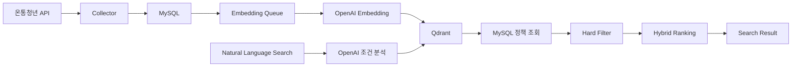

# Youthcenter Search

온통청년 정책을 수집하고 MySQL과 Qdrant에 저장하여 자연어 기반으로 검색하는 청년정책 RAG 서비스입니다.

## 기술 스택

- Java 17, Spring Boot 3.5.16, Gradle Groovy DSL
- Spring MVC, Spring Data JPA, Flyway, MySQL 8.4.3
- Spring AI 1.1.8, OpenAI Chat/Embedding, Qdrant
- Thymeleaf, Vanilla JavaScript, CSS
- JUnit 5, MockWebServer, Testcontainers

## 아키텍처



사용자 검색 시 온통청년 API를 실시간 호출하지 않습니다. 정책 수집과 임베딩은 관리자 화면에서 사전에 실행하고, 검색은 MySQL과 Qdrant에 저장된 온통청년 정책만 사용합니다.

## 온통청년 API

현재 API만 사용합니다.

```text
GET https://www.youthcenter.go.kr/go/ythip/getPlcy
```

요청 파라미터:

- `apiKeyNm`: 서버 설정에서만 사용하며 화면과 로그에는 마스킹합니다.
- `pageType=1`: 목록 조회
- `pageType=2`: 상세 조회
- `pageNum`, `pageSize`, `plcyNo`, `rtnType=json`

실제 응답 구조:

```json
{
  "resultCode": 200,
  "resultMessage": "성공적으로 데이터를 가지고 왔습니다.",
  "result": {
    "pagging": {
      "totCount": 0,
      "pageNum": 1,
      "pageSize": 100
    },
    "youthPolicyList": []
  }
}
```

`pagging` 오타를 우선 지원하고, 향후 서버 변경에 대비해 `paging`도 보조로 읽습니다.

## 비밀 설정

실제 비밀값은 `config/application-secret.yml`에 둡니다. 이 파일은 Git에 포함하지 않습니다.

```powershell
Copy-Item config/application-secret.example.yml config/application-secret.yml
```

IntelliJ 또는 `bootRun`은 `config/application-secret.yml`을 읽습니다. Docker Compose는 루트 `.env`를 읽습니다. Spring Boot는 별도 라이브러리 없이 `.env`를 자동으로 읽지 않습니다.

RAG 활성화 예:

```yaml
SPRING_AI_MODEL_CHAT: openai
SPRING_AI_MODEL_EMBEDDING: openai
RAG_ENABLED: true
YOUTH_CENTER_API_KEY: ""
OPENAI_API_KEY: ""
```

실제 API 키, 관리자 키, DB 비밀번호, Qdrant API Key는 README, HTML, JavaScript, 테스트 Fixture에 넣지 않습니다.

## 로컬 실행

```powershell
docker compose up -d
.\gradlew.bat clean test
.\gradlew.bat bootJar
.\gradlew.bat bootRun
```

macOS/Linux:

```bash
docker compose up -d
./gradlew clean test
./gradlew bootJar
./gradlew bootRun
```

기존 MySQL/Qdrant가 같은 포트를 사용 중이면 compose 서비스가 시작되지 않을 수 있습니다. 기존 볼륨 삭제가 필요한 경우에도 `docker compose down -v`는 데이터 삭제 명령이므로 직접 판단해서 실행하세요.

## 화면

- 사용자 검색: `http://localhost:8080`
- 관리자 개발 화면: `http://localhost:8080/dev`

관리자 API와 `/dev` 화면은 `X-Admin-Key` 또는 화면 입력 관리자 키를 사용합니다. 관리자 키는 `sessionStorage`에만 저장합니다.

## 전체 수집 흐름

1. 1페이지 호출
2. `result.pagging.totCount`로 전체 페이지 계산
3. 페이지별 원본 응답 1회 저장
4. `source_type=YOUTH_CENTER`, `source_policy_id=plcyNo` 기준 Upsert
5. `policy_condition`은 갱신, `policy_region`은 차이만 반영
6. 반복 페이지나 동일 첫 정책 번호가 감지되면 중단

상세 조회는 `DetailFetchMode`로 제어합니다. 기본값은 `MISSING_ONLY`이며 목록 응답에 핵심 필드가 충분하면 상세 API를 호출하지 않습니다.

## 임베딩 흐름

관리자 화면에서 전체 활성 정책을 임베딩 대기열에 등록합니다.

- 문서 ID는 정책 ID 기반 결정적 UUID입니다.
- 문서 내용 SHA-256이 같으면 재임베딩하지 않습니다.
- PENDING을 batch-size만큼 반복 조회해 0건이 될 때까지 처리합니다.
- 한 정책 실패는 해당 정책만 FAILED로 표시하고 다음 정책 처리를 계속합니다.

## RAG 검색 흐름

1. 자연어 조건 추출: OpenAI ChatModel, 실패 시 RuleBased fallback
2. 검색 Query 생성 및 OpenAI Embedding
3. Qdrant 후보 검색
4. MySQL 정책 로드
5. 지역, 나이, 취업, 학생 상태, 신청 상태 Hard Filter
6. Semantic Score와 조건 점수를 합산해 Hybrid Ranking
7. 검색된 정책만 근거로 답변 생성

검색 관련도는 신청 가능성을 확정하지 않습니다. 최종 신청 자격은 정책 상세와 공식 기관을 확인해야 합니다.

## 주요 API

사용자:

- `POST /api/policies/search`
- `GET /api/policies/{policyId}`
- `GET /api/policies/{policyId}/raw`

관리자:

- `GET /api/admin/status`
- `POST /api/admin/youth-center/probe`
- `POST /api/admin/jobs/policy-collection`
- `POST /api/admin/jobs/embedding-queue`
- `POST /api/admin/jobs/embedding-process`
- `POST /api/admin/jobs/embedding-retry-failed`
- `POST /api/admin/jobs/full-reindex`
- `GET /api/admin/jobs/{jobId}`
- `GET /api/admin/jobs/latest`
- `POST /api/admin/qdrant/search`

## 테스트

```powershell
.\gradlew.bat clean test
.\gradlew.bat bootJar
```

자동 테스트는 실제 온통청년 API와 OpenAI API를 호출하지 않습니다.

## GitHub 저장소

대상 저장소:

```text
https://github.com/STUDIOYM-bb/youthcenter-search.git
```

commit 전에 다음을 확인합니다.

```powershell
git check-ignore -v config/application-secret.yml
git check-ignore -v .env
git ls-files config/application-secret.yml
git ls-files src/main/resources/application-secret.yml
git ls-files .env
```

## 문서

- [Architecture](docs/ARCHITECTURE.md)
- [ERD Implementation Checklist](docs/ERD_IMPLEMENTATION_CHECKLIST.md)
- [Youth Center Field Mapping](docs/YOUTH_CENTER_FIELD_MAPPING.md)
- [Collection Flow](docs/COLLECTION_FLOW.md)
- [Embedding Flow](docs/EMBEDDING_FLOW.md)
- [RAG Search Flow](docs/RAG_SEARCH_FLOW.md)
- [Local Setup](docs/LOCAL_SETUP.md)
- [Troubleshooting](docs/TROUBLESHOOTING.md)
