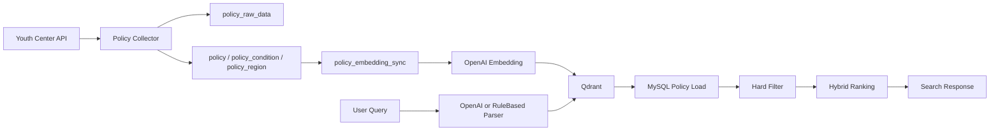

# Architecture

Youthcenter Search는 온통청년 API만 정책 원천으로 사용한다.

수집, 임베딩, 검색은 분리되어 있다. 사용자 검색 요청은 온통청년 API를 호출하지 않고, 이미 저장된 MySQL/Qdrant 데이터만 사용한다.

## 주요 모듈

- `youthcenter`: 온통청년 API Client, 실제 응답 DTO, Parser
- `policy`: ERD 핵심 Entity, Repository, 수집 및 저장 서비스
- `rag`: 문서 생성, 임베딩 동기화, 자연어 조건 추출, RAG 검색
- `admin`: 관리자 상태와 백그라운드 Job API
- `web`: 사용자 화면과 개발 화면
